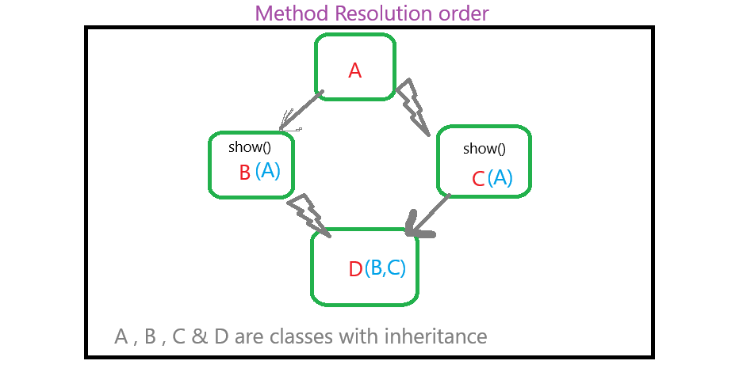

# OOPS Object Oriented Prograimming programming.


### Class : Class is a blueprint of object.
1. Structure , pattern , prototype of an objects
2. Contains logical description.
3class do not occupy much memory as object.

#### class
> in class we define state and behavior of an object inside a class
#### How to achieve class in python ,
1. How to define class in python.
```python
class <class_name> : # <class_name> should be a identifier
    # implimentation of state and behavior
```
>  python is a functional programming language. <br>
> functional programming : functions inside libraries.
2. Implimentation
```python 
class Students :
    # variables :
    s_id = ""
    roll_no = 0
    email = "ex@example.comdlete"
```
3. Class Members : who would be the members of a class., class contains following things
    - variables also known as data members.
    - constructors
    - methods or functions also known as member functions.
4. 
5. Memory Representation
#### AI ML GenAI Agentic AI
// java has inner class and blocks , complex rules of java , nested class.
ex. Design and structure of class.

# Everything which takes space in the world is a real object.

### objects : Real Entity or instance of class,

1. object will occupy memory. 
2. physical representation of a class.
3. object is a run time entity as memory is allocated 
4. When an object is created memory is allocated to it based on class definition
5. objects and instance means same.
6. object is an working instance of a class created at run time.
ex , real car entity.

### How to access and use members of class
> using objects via dat operator '.' , <br>
> dot operator is used for reference <br>
> we can access variables and methods outside class using dot operator.

## constructor

```pycon
def __init__(self) :
    pass
```
### self 
1. self is a keyword and reference to the current object. 
> self reference current invoking object , 
2. self is a reference variable to the current object or instance of the class.
3. self helps methods to know the current working object.
4. self is used inside class methods to access instance variables of current working object.
5. self work as instance variable 
6. self must be the first parameter in instance method , method of function.
> `` def __init__(self,id,name) :``
7. We do not need to pass 'self' explicitely while calling method or functions.
> Every time we call a method or an object , python automatically passes object as a first parameter or as a first argument <br>
> `` c1 = Customer(101,"AT")`` # we didn't passed self  <br>
> c1 is the current object passed in the self automatically by python
 
? Who carry the actual value : 
reference variable v/s variables { Actual real time storage }
reference variables holds the address of actual variable.

### Types of variable : level 2
> named storge location , variable name known as Domain Name
1. Instance variable : 
> variables related to the instance are called instance variables
2. Class variable  : also called static variable .
> variables related to the class are known as static variable 
3. Local variable
4. Global variable

#### Instance Variable
1. Instance variables are defined inside special method called '__init__' also known as constructor. using 'self' <br> ``self.var_name``
2. instance variables belongs to the specific object.
````python
def __init__(self,name,id) :
   self.name = name # name is called instance variable
   self.id = id # id in self.id is called instance variable
    pass
````
3. Different objects will have different copy of instance variable.
4.  change in one instance variable of an object do not change instance variable of another object.
5.  instance variables are unique for unique objects.
```python
class Student:
    def __init__(self, name, age):
        self.name = name      # instance variable d
        self.age = age        # instance variable

s1 = Student("Rahul", 20)
s2 = Student("Anita", 22)

print(s1.name)  # Rahul
print(s2.name)  # Anita

```
6. instance variables can be declared inside '__init__' function and can be accessed inside 'init' or outside 'init' using 'self' instance.
7. We can declare any number of instance varialbes.
8. memory allocated to instance variable depends on number of objects.

### class variables  or static variable
1. class variables are common for all objects.
2. class variables declared inside class but initialized outside class.
3. class variables can be accessed using className , self or Object.
4. Only one copy of memory is shared among all objects for the static variable.
```python
# class
class Car:
    wheels = 4  # class variable

    def __init__(self, brand):
        self.brand = brand  # instance variable

car1 = Car("Toyota") # object declaration
car2 = Car("Honda")

print(car1.wheels)  # 4 # class variable accessed using objectName
print(car2.wheels)  # 4
print(Car.wheels) #  class variable accessed using class name
```

### local variables 
1. local variables :  variables which are accessed within a scope ,
2. local variables defined in the functions
3. local variables not accessible outside class

### global variables 
1. Those variables which are declared inside main function.
2. variables accessible throughout program


## Constructor 
1. Constructor is a special method which is initialized when object of the class is declared.
2. instance variables are declared inside constructor.
3. python's constructor's name is not same as className
> In python constructor special function always named as '__init__' <br>
> python provides a fixed constructor name called '__init(self)' <br>
> constructor of the class automatically called when object of the class is created or initialized.
4. Constructor's task is to initialize the instances variables for different objects.

## Types of Constructors
1. Default constructors : Without parameters
2. Default Argument constructors , with default parameters

> How many constructors we can declare and use in a program ?

## Constructor overloading : using more than 1 constructor in a program in python 
> Early binding , static , function overloading parts of polymarphism
### is python support constructor overloading
> Python has interpreter it doesn't support compile time polymorphism.
> <br> python do not have compiler.
### Why need for constructor overloading, 


## Methods : are the behavior and functionality of the objects
### Types of methods in python
1. Instance method
2. class method
3. static method

### Instance methods
```python

```
1. Instance methods are used to access and modify object data.  
2. Instance method takes 'self' as a first parameter.. 
3. constructor and instance method both takes 'self' as a first parameter
4. Instance method will be only invoked using object reference with dot operator.

### Class methods
```python
class Order :
   app : "IPT"
   sub_discount = "40%"
   def __init__(self,ord_id,level):
      self.ord_id = ord_id
      self.level = level
    @classmethod
    def show(cls):
       print(Order.app,Order.sub_discount,sep=" ")
       
       
s1 = Order(1,3)
s1.show()

```
1. class methods are used to access and  modify class data .
2. class methods takes 'cls' as first parameter
3. 'cls' is object of class 
4. class methods takes '@classmethod' decorator to define class method.
5. behave like normal instance method but method belongs to the class not object. 
6. 

### Static method
```python
class H :
   @staticmethod
   def clgid_decorator(clg_id):
      return clg_id > 1 and clg_id <= 999


```
1. static method is used when functionality of the class but doesn't need instance variables or class data.
2. static method do not take parameters like 'self' , 'cls'
3. declared using '@staticmethod'

### Access Specifiers or Scope
1. public , private , protected used by convention as actually public,private and protected are same.
2.  in python, we just consider public access by all , private can access by only class itself and protected can only access by derived class and objects.
3. Just like Constants in python , python doesn't support constants but for sake of simplicity or by convention we declare constant In capital letters.

```python
# public variables in python - class variable
a = 1
# protected variable in python - class variable
_a = 1
# private variable in python - class variable
__a = 1


# public instance variables , inside constructor
self.a = 1

# protected instance variables , inside constructor
self._a = 1

# protected instance variables inside constructor
self.__a = 1
```
<p> public variables can be accessed outside class via objects and class.</p>
<p> protected variables can access by derived classes or subclass </p>
<p> private variables can be access and modified within the class</p>

```text

```

> [!note]
> In python we can delete objects and also their attributes


## Destructores
```text
If no constructor is not defined explicitly then python interpreter run default constructor
```
0. Destructor is a special method which invoked when an object is about to be destroyed.
1. default destructor is created using '__del__'
2. default constructor run automatically .
3. __del__ called when object is deleted. 
4.  __del__ used to clean up code and free resources like file connection and database connections. # sql # file handling.
```text
Java build enterprise application , Myntra , Banking_solutions. sprint boot,  

python can be used to make , desktop apps , AI , ML , Data Science , pandas, 
security code 

chatGPT is a Generative AI , can't book ticket , gives info,  
Agentic AI ,


```
# Inheritance : Hierarchy of classes , extending class.
```text

using properties of existing class into another class is known as.

super class : it is a existing class from which other classes copy or use properties and attributes of that class.

super class is also know as 'Base class' , 'Parent class'.

Sub Class : classes those inherit properties from the existing class, or from super class.
sub class is also known as child class , and derived class.

```
### Realtionship
1. has a relation : using objects of another class 
2. is a relation :  if using properties of superclass using inheritance

### Single inheritance 
1. Superclass's attributes inherit by a single sub-class. s-s
```text
In Single level inheritance :

if a class B inheriting properties of class A, then class A is called 'superclass' and extending class B is called 'sub-classb'

```
> [!note]
> 'Object' is the default super-class of all classes defined in python. <br>
> In java , java is a default super-class of all the classes. <br>
> In c++ such concept doesn't exist.

### Types of Inheritance : there are 5 types of inheritance in cpp
1. Single Inheritance
2. Multilevel Inheritance
3. Multiple Inheritance
4. Hierarchical Inheritance
5. Hybrid Inheritance


## Single Inheritance
1. class 1 inheritance inherit property of only one superclass

## Multi-level Inheritance
1.  inheritance in which subclass has a subclass ,
2. Multiple single inheritance 

## Hierarchical Inheritance :
1. Multiple subclasses of a superclass

## Multiple Inheritance 
1. Multiple superclasses of a subclas
## Hybrid Inheritance
1. use of more than 1 inheritance 

```text
What is the use of default constructor in python.
it is used to initialise instance variables.

we can add the instance variable even after __init__ or default constructor.
```

### super().
1. it can call parent class method 
2. it can call parent class constructor `` super().method()`` or `` super().__init__()``
3. super(). only refer to direct superclass 


# Polymorphism
1. same object different implementation.
2. polymorphism is ability of an object to behave differently at different situations and different context.
## Types of polymorphism

| polymorphism  1 | polymorphism 2 | 
|-----------------|----------------|
| static          | dynamic        | 
| early binding   | late binding   | 
| Compile time    | runtime        | 

1. Operator overloading.
2. method overloading. python do not support method overloading.
3. method overriding.


## Method Overriding 

1. Implementing new behavior of existing method of superclass in a subclass having same signature.
2. method overriding help us to override and improving existing functionality.
3. best practice of software development is not to modify existing class.

### why do we use subclass.
1. adding functionality .

### Rules for method overriding.
1. Python doesn't enforce strict signature method rules, python use conv
   2. overridden method should be defined in both the classes or available in superclass and subclass
3. method signature like method name and parameters should be same in both the superclass and sub class .
4. overridden methods of both the class can have different behaviors,
5. access specifiers like public, and protected and private is not strictly enforced.
6. Method overriding always applies to instance methods. <br>
7.  class methods and static method do not support method overriding.
> Java and c++ has proper and strict and complex rules,  


### Standard operators 
`` + , - , * , / , = ``
1. Basic work
```text
10 + 10 = 20
1 * 2 = 2
1 == 1

```
2. Extended work 
```text
'ji' + "ok" = 'jiok'
'j' * 2 = 'jj'
'1' == '1'
```
## Diamond problem and Method order resolution.



1. if we create object of class D and call function show()  then whose function wll be execute first.
2. we can see it by <class-name>.mro() function


### Encapsulation

1. Wrapping of data and methods into a single class.
2. ex. capsule


### Abstrction

1. Process of hiding implementation and showing only important details.
2. We can achieve True abstraction using importing ABC module @abstractmethod decorator.  
3. Use abstraction when we want to define common functionality, that multiple subclasses must follow

### - Abstract class
### - abstract methods

1. Abstract class :
- those class which inherits abc class from the module abc.
- we can not create objects or instances of abstract class.
- abstract class force subclass to implement al the abstract methods.

2. Abstract methods :
- Those methods which are decorated with @abstractmethod
- abstract methods are only declared in abstract class.
- @abstractmethods should be overridden by subclasses.

### Duck typing
1. if it looks like a duck and walks like a duck then it is a duck
```python

class Dog :
    def speak(self):
        print("I am dog., i woof")

class Cat :
    def speak(self):
        print("I am cat., i Meow")
class Tiger :
    def speak(self):
        print("I am tiger., i Roar")

class Human :
    def speak(self):
        print("I am human., i speaks frequently")


def can_speak(obj) :
    if obj.speak() :
        # print( obj.speak() == 'True') # what doesn't work
        obj.speak()


if __name__ == '__main__' :
    obj1 = Human()
    obj2 = Cat()
    obj3 = Tiger()
    obj4 = Dog()

    can_speak(obj1)
    can_speak(obj2)
    can_speak(obj3)
    can_speak(obj4)
```
